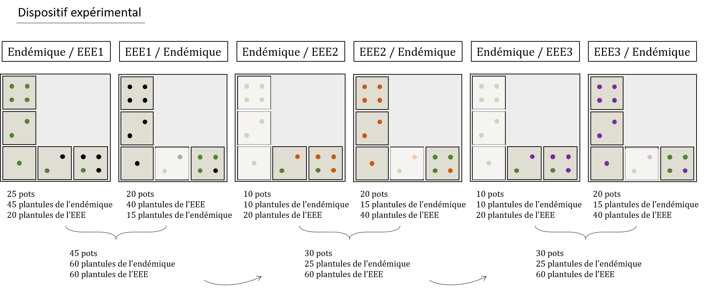

# Margaux et les plantes invasives

## Projet

Les flores régionales ont été façonnées par une succession d’évènements
de colonisation et d’extinction durant des millions d’années. Au cours
des derniers siècles, les activités humaines ont augmenté la fréquence
de ces évènements de façon inédite. L’introduction d’espèces
envahissantes et la perte d’espèces indigènes (souvent endémiques)
associée induisent une diminution du caractère unique des flores
régionales, un processus appelé ‘’homogénéisation biotique’’. Les
mécanismes par lesquels les plantes exotiques parviennent à remplacer
les plantes indigènes ont alimenté de nombreuses hypothèses bien
établies (e.g. exclusion compétitive, rupture des mutualismes, fusion
invasive, nouvelles armes biochimiques). Ces hypothèses ont cependant
rarement été évaluées in natura ou en s’appuyant sur des plantes
endémiques menacées d’extinction. Cela rend difficile l’identification
des processus d’invasion les plus prégnants qui doivent être
prioritairement ciblés pour atténuer la crise de biodiversité. Cette
thèse étudie les mécanismes écologiques qui sous-tendent
l’homogénéisation biotique dans l’archipel des Mascareignes (océan
Indien), l’un des épicentres mondiaux d’invasions biologiques et
d’extinctions d’espèces. Elle se base sur : 1) des observations de
terrain au sein de populations d’arbres endémiques en voie d’extinction,
2) des modèles hiérarchiques Bayésiens de communauté, et 3) des
expérimentations en conditions contrôlées.

## License

Open data (CC-BY 4.0 compatible with Etalab)

## Direct link to download raw datasets

Work in progress

## Thematic scope (All biodiversity including paleo- and archaeo-biodiversity)

Interactions biotiques Invasions biologiques Espèces endémiques menacées
Systèmes insulaires Jsdm La Reunion Island

## Geographic scope (Data produced by France)

Île de la Réunion

## Temporal coverage (at least one data acquisition date)

Work in progress

## Abstract

J’ai fais super génial, hyper intéressant qui m’a cassé le dos, j’ai
poussé de trop grosses brouettes avec des roues cassées.

## Title, authors and contacts

Margaux Rojat

## Acquisition framework (at least via a text field)

<figure>

<figcaption aria-hidden="true">Dispositif</figcaption>
</figure>

## DOI / unique identifiers

DOI:

## taxonomic coverage (if taxa are present)

Plante vasculaire de l’Ile de la Réunion

## Mots clés

Biological invasion , Competition , Pot experiment , Performance

## Data attributes (Dictionary of data attributes with units and descriptions)

| variable | unit | type | description |
|:---|:---|:---|:---|
| mod2 |  | chr | Identifiant de l’individu, combinant la modalité dépendant du nombre d’individus et d’espèces compétitrices dans le pot. Basé sur Hart et al., 2018. |
| modalite |  | chr | Code alphanumérique décrivant la présence d’une ou deux espèces compétitrices ainsi que l’effectif des individus dans le pot. |
| sp1 |  | chr | Code 6 lettres de l’espèce 1. |
| sp2 |  | chr | Code 6 lettres de l’espèce 2. |
| pot |  | int | Numéro entre 1 et 5 du réplicat. |
| sp |  | chr | Code 6 lettres de l’espèce de l’individu mesuré. |
| ind |  | int | Numéro dans le pot de l’individu mesuré. |
| etat |  | fact | Etat de santé initial de l’individu mesuré. |
| origine |  | chr | Origine de l’individu (semence ou sauvageon) |
| nbleaves1 |  | int | Nombre de feuilles de l’individu mesuré à l’état initial |
| le length | cm | num | Longueur de la plus grande feuille de l’individu mesuré à l’état initial |
| le width | cm | num | Largeur de la plus grande feuille de l’individu mesuré à l’état initial |
| st diam | mm | num | Diamètre de la tige de l’individu mesuré à l’état initial |
| st length | cm | num | Longueur de la tige de l’individu mesuré à l’état initial |
| obs |  | chr | Nom des observateurs au moment de la mesure |
| date |  | date | Date de la mesure |
| mort |  | fact | Etat de l’individu mesuré à t + 1 |
| area | cm² | num | Aire foliaire de la plus grande feuille de l’individu mesuré à t = 0, obtenue par le produit de la longueur (le length) et la largeur (le width) |
| masse | g | num | Masse de la plus grande feuille de l’individu mesuré à t = 0, obtenu par prédiction. |
| masse_tot.x | g | num | Masse totale du feuillage à t = 0, obtenue par le produit de la prédiction de la masse de la plus grande feuille et du nombre de feuilles de l’individu mesuré. |
| vol |  | num | Volume total de la tige de l’individu mesuré à t = 0, obtenu par le produit de la longueur de la tie de l’individu mesuré. |
| masse_tot.y | g | num | Masse totale du feuillage à t = 1, obtenue par le produit de la mesure de la masse des feuilles et du nombre de feuilles de l’individu mesuré. |
| vol_tot | cm² | num | Volume total de la tige de l’individu mesuré à t = 1, obtenu par le produit du diamètre et de la longueur de la tige de l’individu mesuré |
| diffmass | g | num | Différence de masse du feuillage de l’individu mesuré entre t1 et t0 |
| diffvol | cm² | num | Différence de volume de tige de l’individu mesuré entre t1 et t0 |
